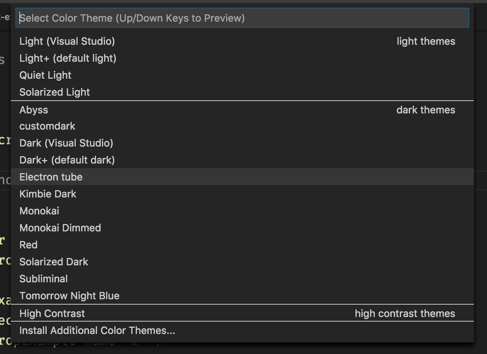

# Vacuum Tube Theme

A dark theme with minimal amount of highlighting for [Visual Studio Code](http://code.visualstudio.com).

Inspired by [Alabaster theme](https://github.com/tonsky/vscode-theme-alabaster)

And [Subliminal](https://github.com/gaearon/subliminal)

## Install

- Copy an entire folder to `~/.vscode/extensions`
- Select `Preferences: Color theme`
  
- Select `Vaccum tube`
  
